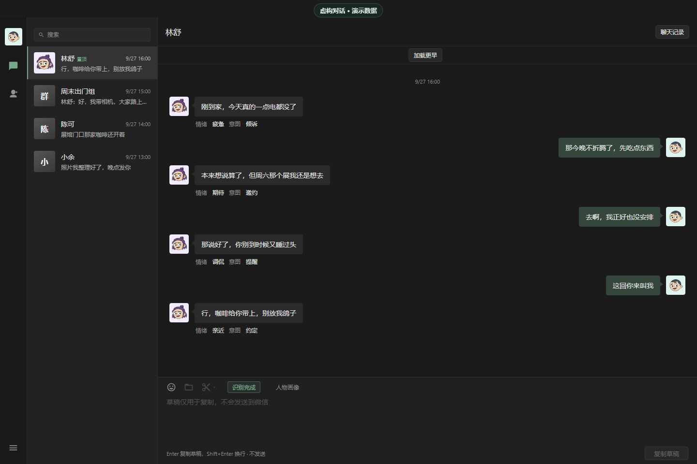
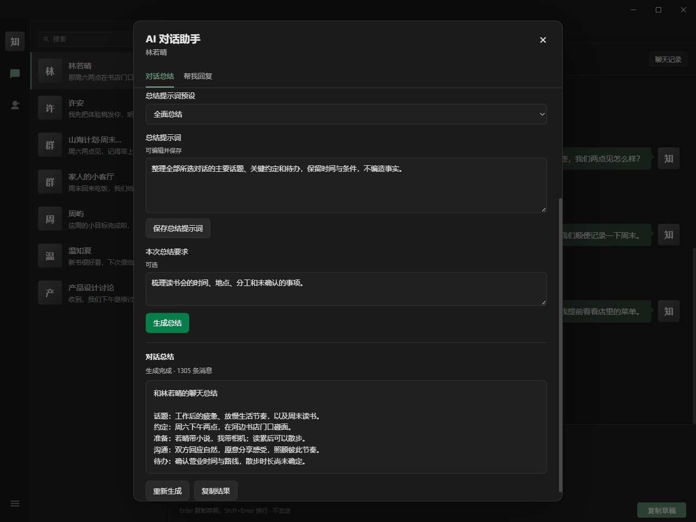
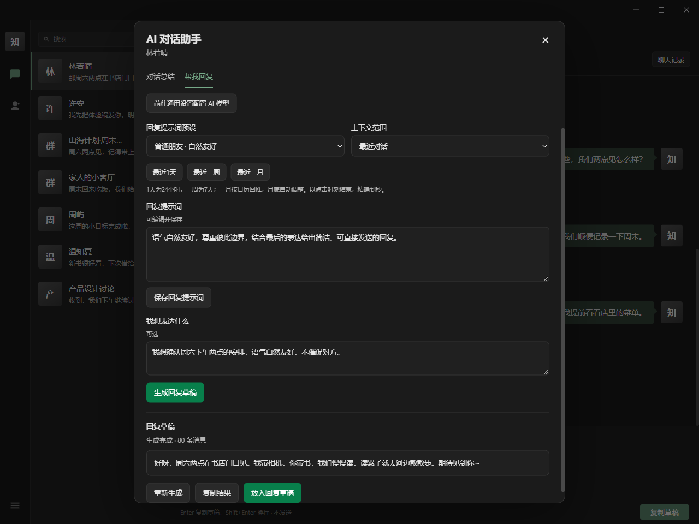
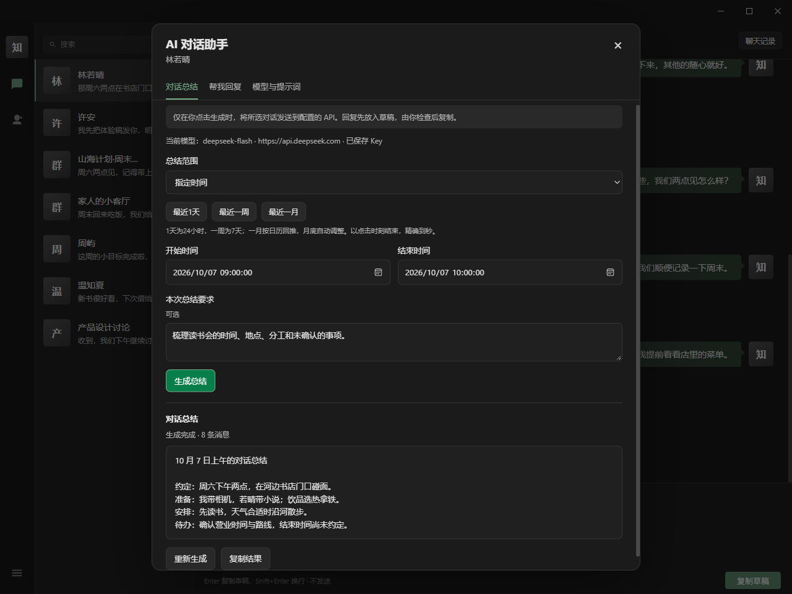
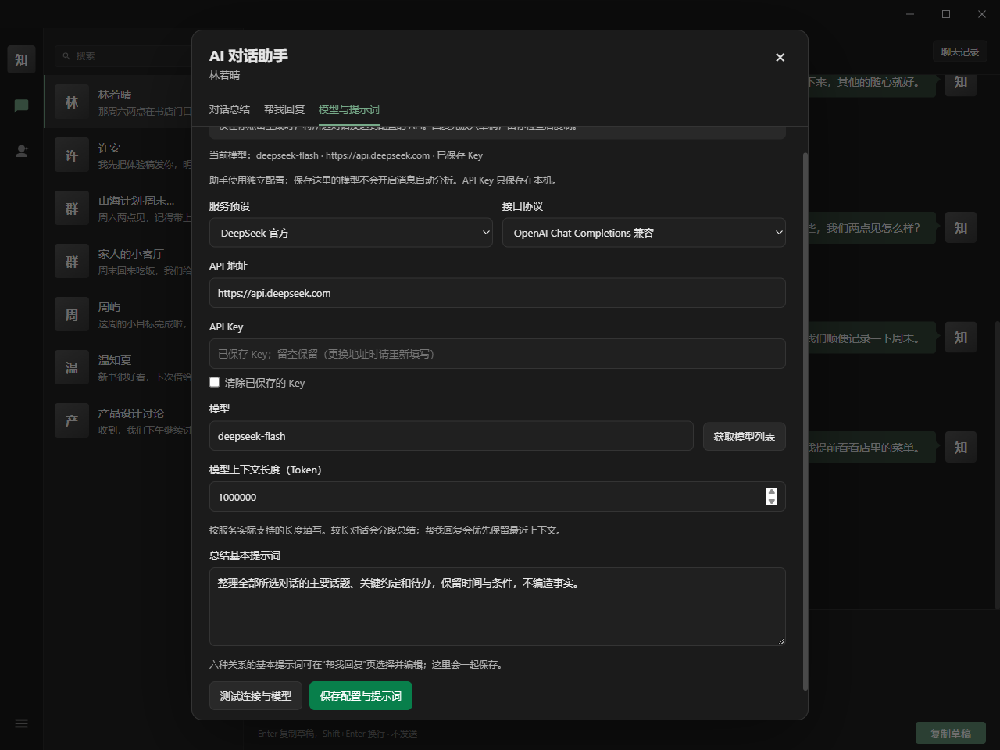
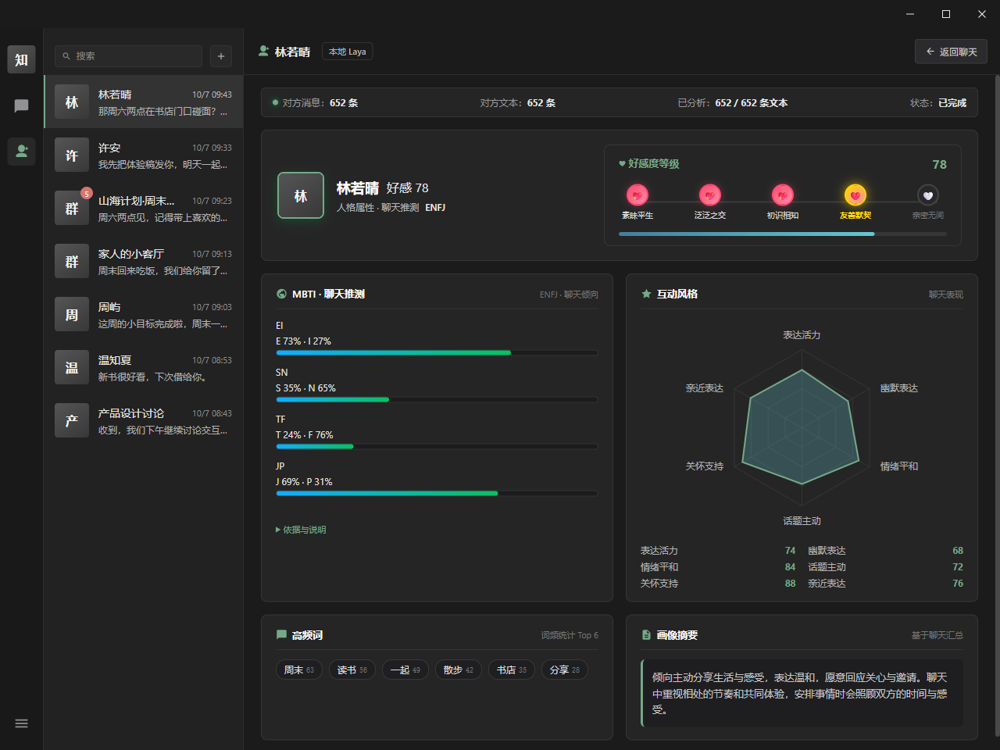
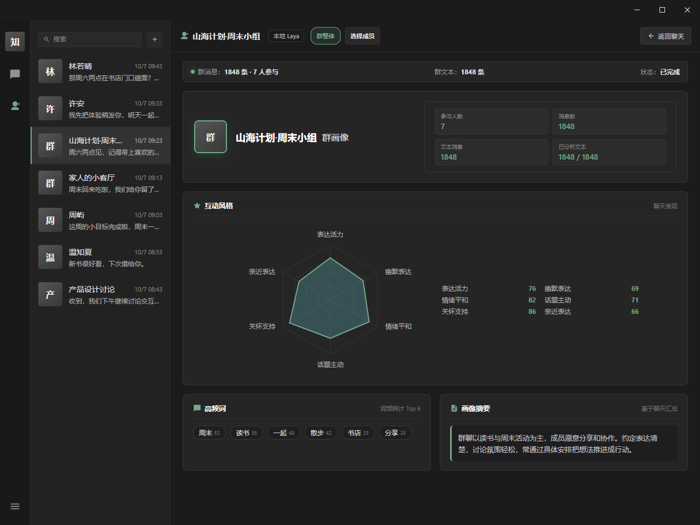
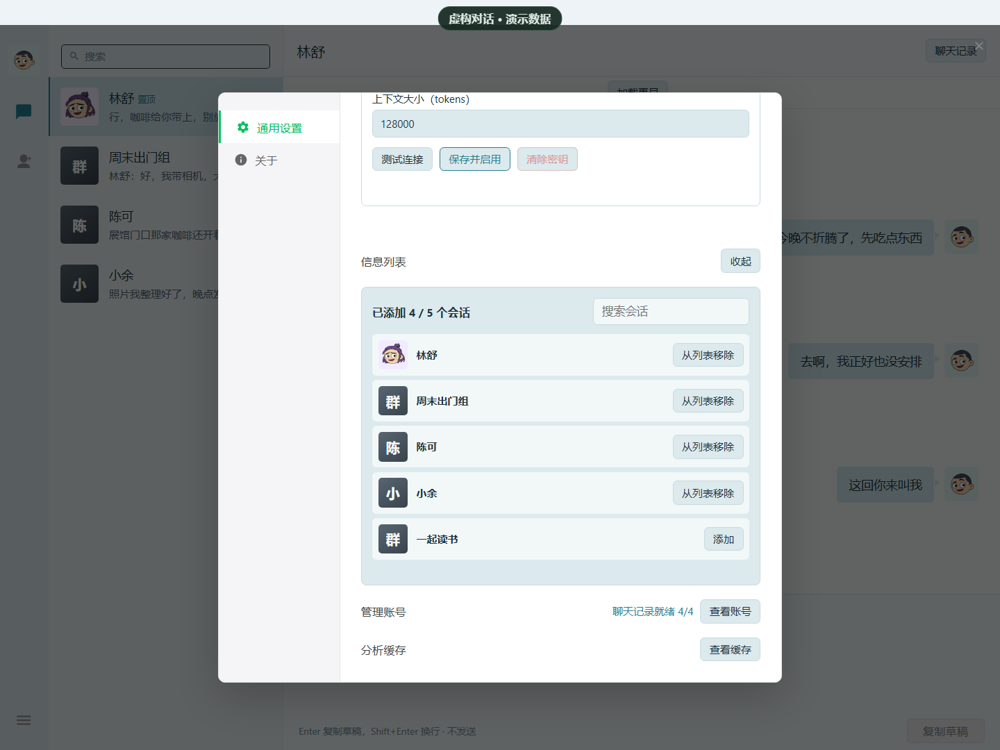
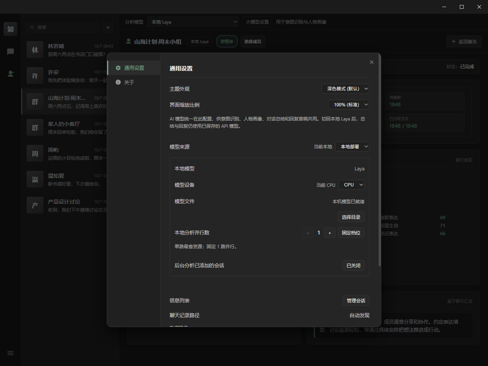
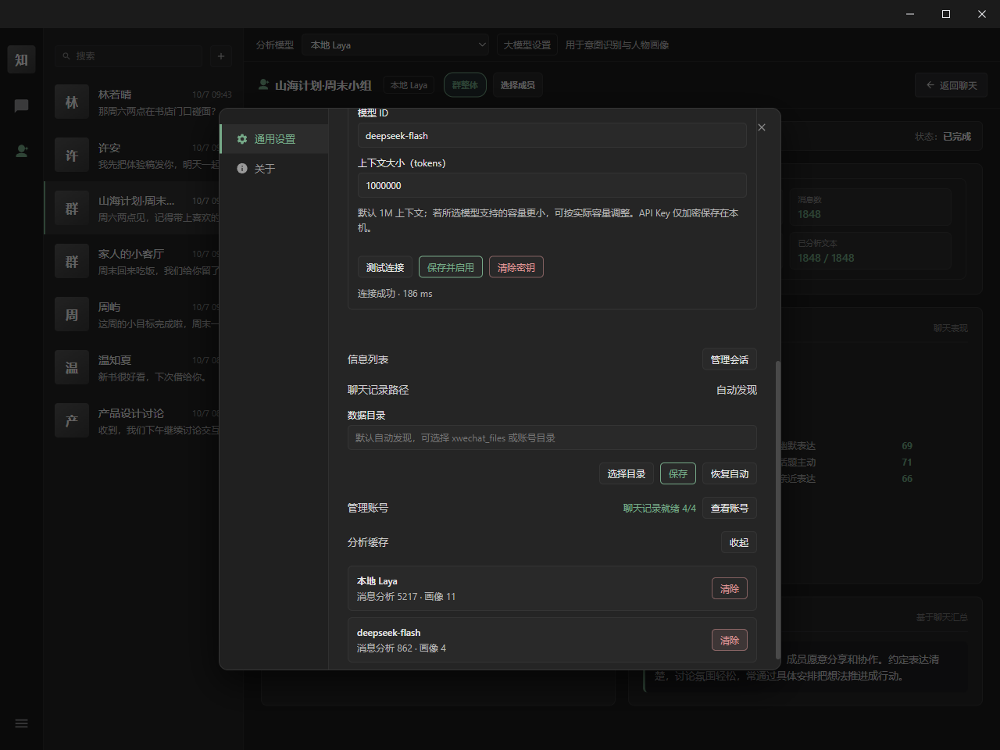

<div align="center">


# 知意 AI · WechatVibe AI

你的微信聊天复盘与回复助手 · 由 [estel-li](https://github.com/estel-li) 维护<br>
AI 聊天总结 · 帮我回复 · 意图识别 · 情绪感知 · 人物画像 · 群聊画像

[](#运行要求)
[](https://tauri.app/)
[](https://github.com/estel-li/WechatVibe-tauri2/releases/latest)
[](LICENSE)

[功能介绍](#功能介绍) · [下载安装](#下载安装) · [首次使用](#首次使用) · [常见问题](#常见问题) · [开发与构建](#开发与构建) · [数据与隐私](#数据与隐私) · [免责声明](#免责声明) · [交流与反馈](#交流与反馈) · [来源与致谢](#来源与致谢)

</div>

知意 AI（英文名 WechatVibe AI）是一款 Windows 微信聊天助手，帮助你整理对话、回顾沟通和准备回复。它只读读取本机已登录账号的聊天，在一个界面里提供 AI 总结、语境回复、消息分析和人物画像。

- **读懂一段对话**：总结当前会话的全部历史或指定时间内的消息，整理主要话题、约定与待办；长历史分段处理，覆盖尚未滚动加载的记录。
- **想好如何回复**：结合上下文和你的表达要求，按普通朋友、亲密朋友、同事、亲戚、长辈或自定义关系生成回复。提示词可编辑，不满意可重新生成。
- **回顾沟通变化**：查看情绪和意图标签、好感度、互动风格、人物与群聊画像，以及基于聊天的 MBTI 倾向。
- **选择自己的模型**：消息分析可使用本地 Laya 或 API；对话助手独立接入 DeepSeek 或自定义服务。支持 Chat Completions、Responses、Anthropic、Gemini 和 Ollama 兼容接口。
- **保留操作决定权**：总结与回复由你主动发起，结果可复制或放入草稿；应用不会自动发送微信消息。



<sub>本页截图来自知意 AI / WechatVibe AI 的 Windows 实际界面。联系人、聊天、标签、画像和 AI 输出均为虚拟演示数据。</sub>

## 功能介绍

### 快捷选择分析模型（1.2.0 开发版）

聊天和人物画像页面顶部提供“分析模型”选择栏，可切换 **本地 Laya** 和 **已配置的大语言模型**，意图识别、情绪标签与人物画像共用当前选择。在“大模型设置”配置 API、获取模型并保存后，同一服务中已获取的模型也可从这里选择；尚未确认上下文容量的模型会先打开配置页。

切换模型会停止旧来源的界面任务，并读取该模型自己的分析缓存。AI 总结与“帮我回复”继续使用独立助手配置。此入口在当前源码和 1.2.0 开发构建中提供，已发布的 1.1.0 可通过通用设置选择分析来源。使用与验证见 [分析模型快捷选择](docs/analysis-models.md)。

### AI 聊天总结与帮我回复

从 1.1.0 起，安装版和绿色版均提供 AI 对话助手。

- **入口**：当前聊天下方，“意图识别”“人物画像”右边新增“AI 总结”和“帮我回复”。无需选择会话时，也能在「设置 → 通用设置 → AI 对话助手」先配置模型。
- **独立模型设置**：提供 DeepSeek 官方预设以及自定义 API，支持获取模型列表、手动输入模型、测试连接和设置上下文容量。助手配置独立于消息意图和画像分析；不会因为启用助手而自动将其他聊天送到 API。
- **全量或时间范围总结**：总结当前会话的完整历史，或指定起止时间内的消息，覆盖界面尚未加载的记录。长对话分段整理后合并，并显示进度；图片、语音等只使用已有类型描述，不猜测媒体内容。
- **语境回复**：使用最近对话，或用户选择的全部/时间范围作为上下文。支持普通朋友、亲密朋友、同事、亲戚、长辈和自定义关系；各类基础提示词可编辑并保存，还能补充本次想表达的意思。
- **重新生成与草稿**：不满意可重新生成，也可调整关系、提示词和要求后重试。结果可复制或放入原有草稿框，由用户决定如何使用；应用仍不会自动发送微信消息。
- **取消与隔离**：支持主动取消，关闭助手或切换会话/账号后取消旧任务并清除过期输出。API Key 使用 Windows DPAPI 加密保存，不回传明文、不放入浏览器 localStorage；总结与回复结果只在当前进程内存中保存。

本地 Laya 继续负责原有本地分析；上述 AI 助手功能使用用户主动配置的 API 或本地兼容接口。临时测试密钥不会预置到源码或发行包。

使用与验证说明见 [AI 对话助手](docs/ai-assistant.md)，包括完整回归、真实 DeepSeek 合成对话测试及 20 项原生桌面验证。

**AI 聊天总结**：整理主要话题、已确认的安排和待办，显示本次覆盖的消息数量。



**帮我回复**：选择与对方的关系，补充自己的意思，生成回复草稿。不满意可以重新生成，满意后复制或放入草稿框，由你检查后使用。



<details>
<summary>截图：指定时间总结与独立助手模型设置</summary>





</details>

### 消息情绪与意图

在聊天页点击「意图识别」，消息下方会显示情绪和意图两个短标签，例如「开心」「期待」「委屈」，或「分享」「邀约」「求安慰」「婉拒」。

- **结合上下文**：参考近期聊天和已保存的人物画像来判断，不只看单句；纯标点消息也能分析。
- **本地与 API 一致**：两种模式显示方式相同。API 模式的每个标签不超过四个字，使用支持流式返回的接口时会边分析边显示。
- **人物情绪与群聊氛围**：单聊顶部显示聊天对象当前的情绪状态，群聊顶部显示整体氛围。
- **随时开关**：关闭标签后再打开，会恢复已有结果。

### 人物画像

从聊天工具栏或左侧导航进入「人物画像」，在同一页面查看好感度、MBTI 倾向、互动风格和画像摘要。



- **好感度**：单聊显示好感度数值和等级，随新消息持续更新。
- **MBTI 聊天推测**：按 E/I、S/N、T/F、J/P 四个维度显示倾向。该人物已分析的有效文本满 100 条后解锁，依据不足的维度显示为未确定。
- **互动风格**：六维雷达图，包括表达活力、幽默表达、情绪平和、话题主动、关怀支持和亲近表达。
- **常聊内容**：根据实际分析过的文本展示高频词。
- **统一计分**：API 模式按上下文容量整批判断聊天，好感度、MBTI、雷达和摘要使用与本地 Laya 相同的累计和打分规则。
- **保存与续算**：再次进入时先显示上次的结果，新消息在原有基础上继续分析，切换聊天或重启软件都不会重新分析全部历史；分析中可查看进度和速率。

### 群聊画像

在群聊中进入画像页面，可以在「群整体」和具体成员之间切换。



- **群整体**：参与人数、消息数量、分析进度、六维互动风格、常见词和群聊摘要。
- **成员画像**：搜索或翻页选择成员，查看该成员的互动风格、摘要和 MBTI 聊天推测。
- **分别保存**：群整体和每个成员各自积累结果，切换时显示对应对象的画像。

### 聊天记录与账号

软件只读读取本机已登录的微信，支持单聊、群聊、联系人和群头像。图片消息显示为 `[图片]`。

- **按需添加会话**：首次进入只读取会话目录，不加载全部聊天。点击左侧搜索框旁的「＋」，或在「设置 → 信息列表」添加要查看的会话；移出列表不会删除缓存或画像。
- **历史记录**：分页查看更早的消息，可按关键词或日期查找，并定位到上下文。
- **聊天记录路径**：自动找不到微信数据时，可在「设置 → 通用设置 → 聊天记录路径」选择 `xwechat_files` 或账号目录，也可以恢复自动发现。选择目录后仍需微信登录并通过账号校验。
- **多账号**：每个微信账号使用独立的数据库，再次登录时复用原有记录。
- **清除账号**：在账号管理中清除某个账号在知意 AI 里的聊天副本、分析和画像，不影响微信本身的聊天记录。清除当前账号后软件会退出。

<details>
<summary>截图：选择要查看的会话</summary>



</details>

### 模型与设置

- **模型来源**：默认使用本地 Laya，也可以接入 API。填写 Base URL、API Key 和上下文大小后，可获取模型列表、测试连接并启用。
- **上下文容量**：API 画像按模型的上下文容量自动分批，装得下就一次处理。完整的画像判断至少需要 12288 tokens 上下文，不足时会提示。
- **分来源保存**：本地和各个 API 模型的结果分开保存，可在设置中分别查看和清除缓存。
- **运行设置**：浅色/深色主题、界面缩放，以及 CPU/GPU 切换；GPU 不可用时可回退到 CPU。

<details>
<summary>截图：模型设置与缓存管理</summary>






</details>

## 下载安装

从 [Releases](https://github.com/estel-li/WechatVibe-tauri2/releases/latest) 下载 Windows x64 安装版或绿色版。当前公开发行版为 **1.1.0**，包含 AI 对话助手、长聊天修复和双语品牌。完整变化见 [1.1.0 发布说明](docs/releases/1.1.0.md)。

| 发行文件 | 使用方式 |
| --- | --- |
| [1.1.0 安装版](https://github.com/estel-li/WechatVibe-tauri2/releases/download/v1.1.0/WechatVibe-tauri2-1.1.0-windows-x64-setup.exe) | 运行安装向导，安装到当前用户目录 |
| [1.1.0 绿色版](https://github.com/estel-li/WechatVibe-tauri2/releases/download/v1.1.0/WechatVibe-tauri2-1.1.0-windows-x64.zip) | 解压后启动，无需安装应用 |

两个标准包都内置 Node/Python 运行环境，不含 Laya 模型权重；本地模式首次使用需在设置中下载模型。源码运行和自行打包见 [开发与构建](#开发与构建)。

本版本运行包的使用方式：

1. 下载 Tauri 2 标准包 `WechatVibe-tauri2-版本号-windows-x64.zip` 或 Windows 安装包。标准包不含 Laya 模型。
2. ZIP 解压后保留整个 `tauri2-portable` 目录，双击 `WechatVibe.exe`。安装包按向导安装后启动。
3. 本地分析需要在「设置 → 本地部署」下载模型，或选择已有、通过校验的模型目录；仅使用 API 时可跳过。

升级请使用本仓库提供的完整运行包，保持与当前安装的架构一致。

### 运行要求

| 项目 | 要求 |
| --- | --- |
| 系统 | Windows 10/11 x64 |
| 桌面运行时 | Microsoft Edge WebView2 Runtime；安装器提供缺失时的安装引导 |
| 微信 | Windows 微信 4.x，保持账号已登录；不支持 3.x。历史读取测试版本为 4.1.15.13，当前离线回归不等同于真实账号验证 |
| Node/Python | 便携运行包内置所需运行时；源码开发需自行安装 |
| 存储 | 便携目录需可写，账号、缓存、模型和 WebView 数据保存在 `client/.local/` |

下面是本地 Laya 的配置参考；低配设备尚未系统测试。

<details>
<summary>本地 Laya 配置参考（只用 API 可以跳过）</summary>

模型约 3.22 亿参数，纯 CPU 即可运行，不需要独立显卡。下表为建议配置，低配设备尚未系统测试。

| 项目 | 建议配置 |
| --- | --- |
| CPU | 4 核及以上 x64 处理器；CPU 推理默认使用 4 线程 |
| 内存 | 8 GB 起步；同时运行微信和其他应用，建议 16 GB 及以上 |
| GPU（可选） | 支持 WebGPU 的显卡和较新的驱动，不兼容时使用 CPU；最低显存要求暂未确定 |
| 磁盘 | 至少预留 4 GB，用于应用、模型下载和安装；聊天缓存和更新备份另算 |
| 模型体积 | 模型包约 599 MB，解压后约 681 MB；文件体积不等于运行时的内存占用 |

首次加载和分析历史消息的速度取决于处理器、内存和聊天量。API 模式不需要下载 Laya，也不需要本地显卡，速度和上下文容量取决于所选的模型服务。

</details>

## 首次使用

1. **登录微信**：使用 Windows 微信 4.x 登录要分析的账号。
2. **启动软件**：双击 `WechatVibe.exe`。账号状态可在「设置 → 管理账号」查看，不用等聊天加载完就能使用界面。
3. **选择模型**：在「设置 → 通用设置」选择模型来源。本地模式下载或选择 Laya 模型；API 模式填写服务地址、API Key 和模型，确认上下文大小，测试连接后保存并启用。
4. **添加会话**：点击左侧搜索框旁的「＋」，或在「设置 → 信息列表」选择联系人或群聊。
5. **查看分析**：打开聊天，点击「意图识别」查看消息标签；进入「人物画像」查看画像，群聊还可以选择具体成员。

## 软件更新

应用保留「设置 → 关于 → 当前版本」的检查、下载、校验、安装与回退流程。**1.0.0 起只检查 `estel-li/WechatVibe-tauri2` Releases。** 更新器使用本版本独立的 Ed25519 公钥，验证对应产品标识、签名及文件布局的 Tauri 2 资产。发布页附带 `update-manifest-tauri2.json`、签名与校验文件供更新器使用；手动安装仅需下载 EXE 或 ZIP。

手动升级时，完全退出应用后使用同架构完整运行包，并保留该安装的 `client/.local` 和 `client/.models`。架构与维护说明见 [MIGRATION.md](MIGRATION.md) 和 [review 记录](docs/review-and-performance.md)，版本历史见 [CHANGELOG.md](CHANGELOG.md)。

## 常见问题

<details>
<summary>一直显示「当前微信账号未就绪」</summary>

- 确认登录 Windows 微信 4.x；旧版 3.x 不受支持。
- 数据在自定义位置时，在「设置 → 通用设置 → 聊天记录路径」选择 `xwechat_files` 或账号目录。
- 选择目录后仍需微信登录并通过账号校验。
- 若仍未就绪，运行启动诊断工具，再到 [本版本 Issues](https://github.com/estel-li/WechatVibe-tauri2/issues) 反馈。

</details>

<details>
<summary>启动时提示「本地服务未就绪」或无法打开</summary>

在 `WechatVibe.exe` 同目录运行随包提供的 `WechatVibe-diagnose.bat`。它会检查文件、运行环境和启动错误并生成报告，不启动应用或模型，不读取聊天数据库和 API Key，也不会自动上传。详见 [启动诊断说明](docs/startup-diagnostics.md)。

便携版需保留完整 `client/`，并安装 WebView2 Runtime。标准包没有模型权重时，进入设置下载或选择模型，或配置 API 模式。

</details>

<details>
<summary>升级后人物画像还是旧的</summary>

已有 API 画像会先保留显示。在画像页点击「更新画像」后才按新规则重新分析，重建期间会注明正在显示旧画像。

</details>

<details>
<summary>模型下载失败、GPU 不可用或 API 分析失败</summary>

模型文件必须通过长度和 SHA-256 校验；可重试下载或选择已通过校验的外部目录。GPU 不兼容时切换 CPU。API 模式检查服务地址、协议、Key、模型名称及上下文大小，在设置中测试连接后保存并启用；完整画像判断至少需要 12288 tokens 上下文。

</details>

## 开发与构建

### Windows 开发

需要 Windows 10/11 x64、Microsoft Edge WebView2 Runtime、Visual Studio C++ Build Tools 与 Windows SDK、当前稳定版 Rust 工具链、Node 24.11.1 及以上的 24.x 版本、标准 Python 3.14 x64。

安装 Rust、Visual Studio Build Tools 的 C++ 桌面开发组件与 Windows SDK 后，在 PowerShell 执行：

```powershell
git clone https://github.com/estel-li/WechatVibe-tauri2.git
cd WechatVibe-tauri2
py -3.14 -m venv .venv
.\.venv\Scripts\python.exe -m pip install --no-deps -r python-requirements.lock.txt
npm ci
npm start
```

`--no-deps` 使用项目已锁定的读取依赖集合。读取组件的可选 GUI、OCR 和媒体依赖不在该集合内，详见 `THIRD_PARTY_NOTICES.md`。项目脚本自动选择 `.venv`；也可以使用 `WECHATVIBE_PYTHON` 指定 Python，`WECHATVIBE_NODE` 指定业务运行的 Node。`npm start` 启动 Tauri 开发宿主，后端和分析 worker 由桌面宿主管理。

开发数据写入本目录 `.local/`。缺少本地模型时，可在原有设置界面下载并安装，或先执行：

```powershell
npm run setup:models
```

模型下载使用原来的 revision、文件长度及 SHA-256 校验。API 模式使用原有设置页；启用后，分析所需的聊天片段发送至所配置的服务地址。

### 构建便携版

```powershell
npm run build:portable
```

脚本先收集锁定 Windows Rust 依赖的许可证，然后在 `.local/tauri-builds/build-*/client` 创建全新 stage，按发行包 RECORD 与 Node 依赖闭包复制 Python、Node、ONNX Runtime，再按清单复制业务代码与页面。它校验文件长度和 SHA-256，将 stage 映射到 `src-tauri/resources/client`，执行与 `npx tauri build --no-bundle` 相同的本地 Tauri CLI，最后创建：

```text
dist/WechatVibe-tauri2/
  WechatVibe.exe
  WechatVibe-diagnose.bat
  client/
    runtime/python/
    runtime/node/
    node_modules/
    scripts/
    bridge/
    analysis/
    chatui/
```

用户双击 `WechatVibe.exe`；无需额外安装 Node 或 Python。便携目录必须可写，数据、账号配置、缓存、日志与 WebView2 用户数据放在该安装的 `client/.local/`。设置页下载的模型位于 `client/.local/models/laya`；构建预先附带的模型位于 `client/.models/laya`。复制不同安装目录会获得不同实例身份与本地端口。标准包不附带 Laya 权重，保留原有首次下载流程；需要包含已有的、通过校验的模型时：

```powershell
npm run build:portable -- --with-model
# 或指定已校验的外部模型目录：
npm run build:portable -- --models-dir D:\Models\laya
```

`--python-exe`、`--node-exe` 与 `--node-license` 可以指定构建输入。Node 的完整许可证必须与所选版本一致：默认从 Node 目录或 `licenses/node-LICENSE-版本.txt` 查找，也可用 `WECHATVIBE_NODE_LICENSE` 指定。构建不读取 `.local`、聊天数据库、账号配置、API Key 或开发环境中的任意未列入清单文件。

构建阶段和验证报告保留在 `.local/tauri-builds/`；最终文件清单写到 `dist/WechatVibe-tauri2-build-verification.json`。已有输出若包含 `.local` 用户数据，构建拒绝替换，可改用 `--output-dir dist/另一个目录`。以前的构建资源和可替换输出保存在当前 build 的 `previous-*` 目录。

### 安装包、测试与发行

```powershell
npm run build:installer
npm test
```

安装包使用当前用户 NSIS 安装模式，资源仍为 `client/`，由 Tauri 的 Windows 安装器处理 WebView2 Runtime。Rust 直接构建可用 `npm run build`；分发前应使用准备完整 runtime 的 `build:portable` 或 `build:installer`。

`npm test` 包括 TypeScript 检查、原有 Node/Python 业务回归、Tauri 适配与 Rust 测试。`npm run test:model` 需要已安装模型，并验证真实本地推理。实际微信账号的读取依赖本机微信及登录状态，离线测试不等同于真实账号验证。

发行更新 ZIP 使用单独的 Tauri 产品标识与根目录，避免接收 Electron 架构更新包：

```powershell
.\.venv\Scripts\python.exe scripts/build-windows-release.py --input dist/WechatVibe-tauri2 --version 1.1.0 --output-dir dist/releases
```

输出 `WechatVibe-tauri2-1.1.0-windows-x64.zip`，内部根目录为 `tauri2-portable/`。`--with-model` 生成单独的 `-windows-x64-full.zip`。签名通过 `scripts/build-update-manifest.cjs` 管理，使用 `WECHATVIBE_UPDATE_SIGNING_KEY_FILE` 指定与应用公钥对应的 Ed25519 私钥；私钥仅在维护者本地保存，不进入 Git、stage、安装包或发布资产。

迁移边界与验证记录见 [MIGRATION.md](MIGRATION.md)，启动诊断见 [docs/startup-diagnostics.md](docs/startup-diagnostics.md)，第三方许可见 [THIRD_PARTY_NOTICES.md](THIRD_PARTY_NOTICES.md)。
### 业务结构与词库

`analysis/` 是由 Node + `tsx` 执行的 TypeScript 分析与生成模块。Python 读取和存储位于 `bridge/`、`native-reader/`；`chatui/` 提供界面；`src-tauri/` 是 Rust + Tauri 2 桌面宿主。后端职责见 [后端架构说明](docs/backend-architecture.md)。

词库源文件为 `scripts/analysis-catalog-source.json`、`scripts/intent-display-source.json` 和 `scripts/social-intent-source.json`。修改时保留既有 ID，再执行 `npm run catalog:generate`。可通过 `npm run catalog:export` 导出显示词库。

源码测试与 UI 验证使用合成数据。真实微信读取取决于本机微信版本和账号登录情况；模型推理需另外运行 `npm run test:model`，在线服务需配置后自行验证。

## 数据与隐私

- **本地模式（默认）**：使用本地 Laya 在本机推理，本地服务只监听回环地址。
- **API 模式（需手动开启）**：消息分析会把当前这批聊天文本和简短的画像参考发送给你配置的模型服务；人物画像会按上下文容量发送所选会话的历史文本，由模型判断后，再由程序计算好感度、MBTI、互动风格和摘要。
- **保存方式**：聊天副本按微信账号保存，分析结果和画像再按模型来源分开。

使用时请注意：

- 只读取自己有权访问的账号和聊天，不用于获取他人的私人记录。
- 清除账号只删除知意 AI 保存的数据，不删除微信原始聊天。
- 软件只分析和展示，不自动发送微信消息，也不提供聊天记录导出功能。
- 不要把聊天数据库、解密密钥、账号缓存或带私人内容的日志上传到仓库、Issue 或交流群。
- 反馈问题前先检查截图和日志，移除不想公开的姓名、账号和对话。

## 免责声明

知意 AI 面向技术学习、研究及个人聊天复盘。使用前请确认数据来源和使用方式符合适用法律、微信服务协议及相关第三方服务条款。

- **功能与使用边界**：本项目不提供微信聊天记录导出功能，本地缓存用于应用内查看与分析。项目不提倡通过导出、传播、交易或再利用聊天记录侵犯用户隐私、数据权益或微信相关合法权益，也不为此类用途提供支持。
- **数据授权**：仅处理本人合法持有、有权访问和分析的聊天记录。能在设备上看到记录，不代表可以任意公开、传播或用于其他目的；涉及他人信息时，应尊重其隐私和合法权益。不得用于盗取账号、未经授权的监控、跟踪、骚扰或其他违法侵权活动。
- **分析边界**：意图、情绪、好感度和 MBTI 均为模型推测，可能遗漏语境或产生错误。结果不等于对方真实想法，不构成心理诊断、人格定性或官方测评，不应作为作出重大个人决定的唯一依据。
- **第三方服务**：启用 API 后，所选聊天片段和画像摘要会按功能需要发送至你配置的服务商。请自行了解其计费、数据保存与隐私政策；项目无法替第三方承诺数据安全、服务稳定性或分析准确率。
- **运行风险**：微信版本、操作系统、权限和第三方组件变化可能影响读取与运行。请保留重要数据备份；项目不保证持续兼容、数据绝不丢失，也不承诺“零风险”或“不会封号”。
- **许可与担保**：本项目依据 [Apache-2.0](LICENSE) 许可证“按现状”提供。除适用法律要求或另有书面约定外，维护者及贡献者不提供任何明示或默示担保，包括适销性、特定用途适用性及不侵权担保；不承诺分析结果准确、运行持续稳定或适合任何特定使用场景。
- **使用者责任**：使用者应自行判断本项目是否适合其用途，并负责取得账号、聊天数据及第三方服务所需的授权。由使用者自行决定的数据处理方式、服务配置、结果使用，以及自行或委托第三方实施的修改、部署与运营，由相应使用者、开发者或运营者承担其行为及承诺所对应的责任。
- **责任限制**：在适用法律允许的最大范围内，且除另有书面约定外，维护者及贡献者不对因使用或无法使用本项目而产生的直接、间接、附带、特殊或后果性损失承担责任，包括数据丢失、账号受限、业务中断及其他损失。担保与责任限制的具体范围以 [Apache-2.0](LICENSE) 许可证第 7 至第 9 条为准。

知意 AI 为独立项目，与腾讯、微信没有官方隶属、合作或背书关系。相关名称、商标及第三方组件的权利归各自权利人所有。

## 许可

项目采用 [Apache-2.0](LICENSE)。Laya、模型与第三方依赖的来源及许可见 [THIRD_PARTY_NOTICES.md](THIRD_PARTY_NOTICES.md)。

本页新版截图使用软件自身的文字头像。仓库历史演示素材中使用的 Lisa Wischofsky [Adventurer](https://www.dicebear.com/styles/adventurer/) 头像采用 [CC BY 4.0](https://creativecommons.org/licenses/by/4.0/)，其素材许可独立于项目代码许可。

## 交流与反馈

- 本版本维护者：[estel-li](https://github.com/estel-li)
- 本版本源码：[estel-li/WechatVibe-tauri2](https://github.com/estel-li/WechatVibe-tauri2)
- 本版本问题反馈：[GitHub Issues](https://github.com/estel-li/WechatVibe-tauri2/issues)

反馈时请说明 Windows、微信、应用版本、模型模式和复现步骤。截图及日志请先去除私聊内容、个人身份、账号、API Key、数据库密钥等私人信息。

## 来源与致谢

本项目的基本聊天读取、情绪与意图分析、人物及群聊画像功能，fork 自 [tswawa/WechatVibe v1.2.4](https://github.com/tswawa/WechatVibe/releases/tag/v1.2.4)。此后的 Tauri 2 架构、界面与性能改进、AI 聊天总结和帮我回复等功能由 [estel-li](https://github.com/estel-li) 持续开发维护。保留原代码中的作者、来源声明、Apache-2.0 许可及第三方素材署名。

- **文档与截图**：基础功能说明参考上游 [README（提交 `99f42f0`）](https://github.com/tswawa/WechatVibe/blob/99f42f07f63e6b2fbceab9fb7020cdb4d98850c3/README.md)，参考日期 2026-10-07。本页功能截图已替换为知意 AI 实际 Tauri 界面的合成数据截图，截图脚本与来源说明见 [截图记录](docs/verification/readme-screenshots.md)。该提交是文档参考版本，不表示本地源码与该提交完全一致。
- **微信读取**：[fanyuantaier/wechatauto-replica](https://github.com/fanyuantaier/wechatauto-replica)。
- **分析模型与适配**：[Laya](https://github.com/NandhaKishorM/laya)、[mizchi/laya-mlx](https://github.com/mizchi/laya-mlx)、[mizchi/laya-multilingual-onnx](https://huggingface.co/mizchi/laya-multilingual-onnx)。
- **上游贡献者**：感谢上游作者与所有贡献者，具体贡献见 [上游致谢](https://github.com/tswawa/WechatVibe#致谢)。

本项目由维护者独立开发和运营。使用、修改或分发时，请保留相应来源与许可。
