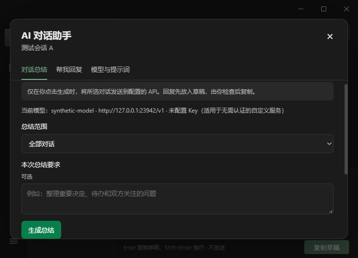
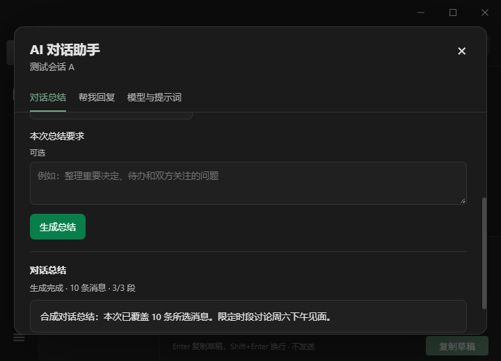
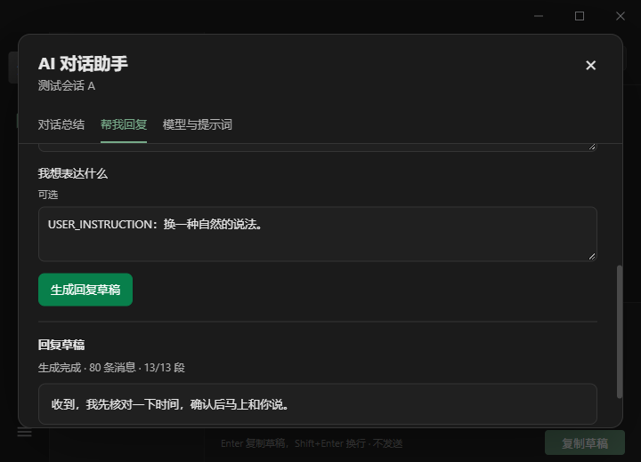
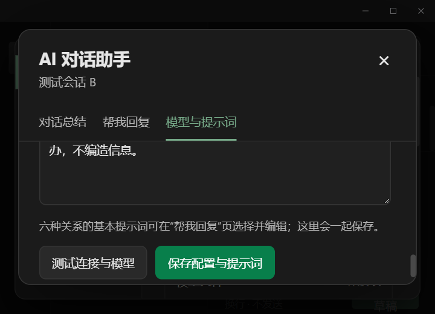

# 知意 AI 对话助手（1.1.0）

知意 AI（WechatVibe AI）在“意图识别”“人物画像”右侧提供“AI 总结”和“帮我回复”，也可从“设置 → 通用设置 → AI 对话助手”预先配置。[1.1.0 安装版和绿色版](https://github.com/estel-li/WechatVibe-tauri2/releases/tag/v1.1.0)均包含此功能。

## 使用

在“模型与提示词”选择 DeepSeek 官方预设或自定义接口，输入 API 地址和自己的 Key，获取模型或手动输入模型 ID，测试连接后保存。助手模型与原有意图、画像模型各自配置。兼容 Chat Completions、Responses、Anthropic、Gemini 和 Ollama 接口。

DeepSeek 官方 `deepseek-flash` 和 `deepseek-v4-pro` 的上下文为 1M tokens，见 [官方模型说明](https://api-docs.deepseek.com/quick_start/pricing)。新建官方配置默认使用 **1,000,000**；自定义服务应填写该服务实际支持的容量。应用仍会为提示词和输出留出空间，超出预算的完整历史会分段处理，而不是截取末尾消息。

旧配置中的任何已保存数值都保留，包括过去的 65,536：旧存储没有记录它是默认值还是用户主动选择，不能据此覆盖你的设置。已识别的官方模型会在设置中提供“使用官方 1M 容量”，点击后还需“保存设置”才会持久化；自定义地址、模型以及旧 `deepseek-chat` / `deepseek-reasoner` 不会自动提升。官方配置若没有保存容量，则读取时采用新的默认值，保存时写入配置。读取设置不会解密 Key、改写旧文件或发起 API 请求。

“AI 总结”支持当前会话的全部历史或指定起止时间；包含尚未滚动加载的消息。长对话自动分批并合并，显示读取和生成进度。时间范围包含起止时刻，消息附带本机时区的可读日期。图片、语音等使用已有类型描述。

总结与回复都有“最近1天 / 最近一周 / 最近一月”：前两项分别取点击时刻之前的24、168小时；一月按本地日历回推，正确处理月底与闰年。点击后自动切换到指定时间，填写秒级起止时刻，仍可手动调整。

长对话的内部笔记有明确的压缩目标与输出余量。如果某段因输出上限截断，会使用完整原片段、更多输出空间和更精简的目标重新整理一次。重复截断会明确失败；完整笔记才参与合并。最终总结最多使用16K输出预算，最终流式响应必须正常完成。

“帮我回复”默认参考最近 80 条记录，也可使用全部或指定时间范围。普通朋友、亲密朋友、同事、亲戚、长辈有各自的基础提示词；支持编辑保存和自定义关系。可补充本次要求，不满意时重新生成。结果可复制或插入原有草稿框，发送由用户自行完成。

点击取消、关闭助手或切换会话会停止旧任务并清除过期输出。更改账号、清除账号或退出应用也会结束所属任务。API Key 通过 Windows DPAPI 加密保存，不回传明文、不进入浏览器 localStorage。生成结果只保留在进程内存中。

## 实现

`chatui/ai-assistant.js` 和样式提供独立弹窗，通过 `/api/assistant/` 访问服务。`bridge/ai_assistant.py` 直接分页读取微信数据源，以稳定的历史上界完成范围快照；客户端不能提交聊天内容替代真实读取。服务启动独立 Node 分析进程，取消不会影响原有意图、画像任务。

`analysis/ai-assistant.ts` 按实际上下文预算分块，超长单条消息无损拆分，多批结果逐层合并。所有选中记录都会参与处理，返回消息数量、分块数量和覆盖信息。提示词将聊天记录与旧草稿明确作为数据，要求避免捏造事实和额外承诺。内部整理过程不作为最终回复流出。

## 验证与复现

2026-10-07 完整 `npm test` 通过：487 项 Node 测试、494 项 Python 测试、8 个脚本测试套件及 4 项 Rust 测试。其中助手覆盖超长 Unicode 消息、全历史覆盖、时间边界、所有关系、自定义和重新生成、配置隔离、敏感信息错误处理，以及取消竞争。1295条合成消息复现为7段，首段截断后完整恢复，消息覆盖齐全、进度为9/9；真实HTTP→Python→Node→合成模型链路同时验证恢复成功与重复截断及时停止。

此前真实 DeepSeek 官方接口使用临时凭证和合成对话验证了模型获取、连接测试、全量总结、时间范围总结、同事回复及自定义关系重新生成，均完成。本次长历史修复使用合成模型服务验证。测试未读取真实微信聊天，凭证未预置到源码或包内。

打包后的 Tauri/WebView2 使用包内 Python、Node、UI 和服务，接入本地合成模型服务进行验证，20项原生检查通过。验证包括双语品牌、完整1305条历史（含最早的未加载消息）、首段截断后的完整恢复、时间范围10条、总结/回复的六个快捷时间按钮、五种关系、自定义要求、重新生成、原生剪贴板、插入草稿、取消与切换会话、获取模型、测试连接、提示词保存、焦点及小窗口缩放。修复验证记录见 [长历史与品牌验证](verification/assistant-long-history/verification.json)，此前首次功能验证见 [原记录](verification/assistant-1.1.0/verification.json)。

发布包包含 Node/Python 运行时，绿色版保留完整目录后启动 `WechatVibe.exe`；本地构建也可以通过 `scripts/build-tauri-portable.py` 生成。升级请保留原有 `client/.local` 与 `client/.models`，详见 [发布说明](https://github.com/estel-li/WechatVibe-tauri2/releases/tag/v1.1.0)。

```powershell
# 完整回归
npm test

# 使用包内运行时和服务重跑原生验证；只使用合成记录与本地模型接口
python scripts/verify-ai-assistant.py --exe dist/WechatVibe-AI-1.1.0/WechatVibe.exe
```

原生验证需要 Windows、WebView2、项目 Playwright 依赖和已构建的可运行目录。输出写入 `.local/assistant-verification/`，测试关闭自己启动的进程并恢复原剪贴板文本。








