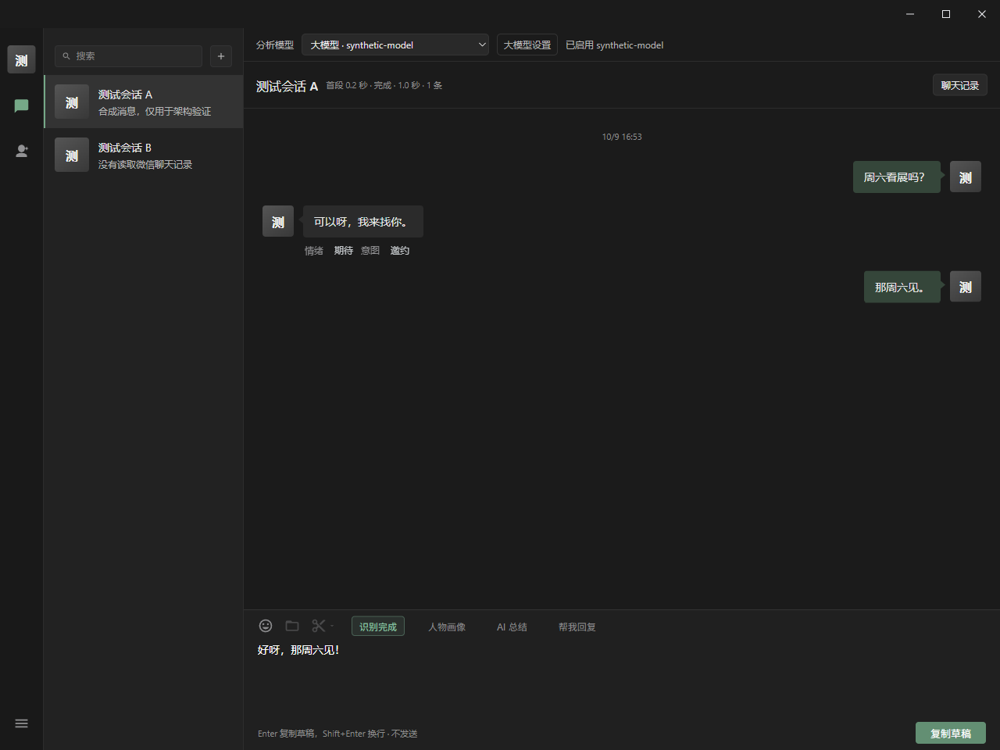
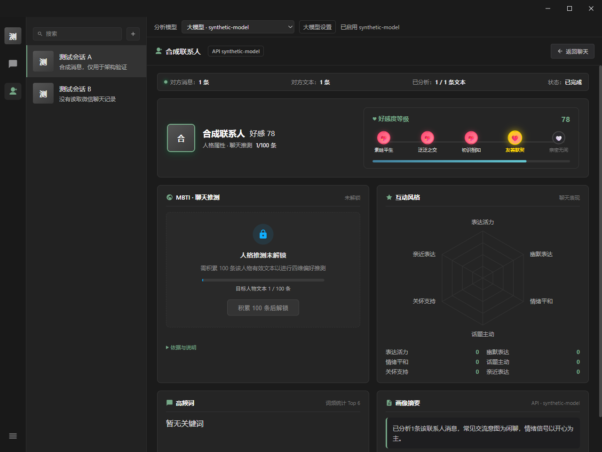

# 分析模型快捷选择（1.2.1）

聊天和人物画像页面上方共用“分析模型”选择栏。选择本地 Laya 或已配置的大语言模型后，消息意图、情绪标签与人物画像使用该模型。选择作用于当前安装的分析来源，AI 总结与“帮我回复”共用通用设置保存的 API 配置，切回本地分析时也可继续使用保存的 API 生成。

## 使用

1. 点击“大模型设置”，在通用设置选择 DeepSeek、MiniMax、智谱、Kimi、硅基流动或自定义服务，填写 Key 和模型（上下文默认 1M），也可调整协议、地址与容量，测试连接后“保存并启用”。支持 Chat Completions、Responses、Anthropic、Gemini 和 Ollama 兼容接口。
2. 返回聊天，通过上方“分析模型”快速切换本地 Laya 和最近保存的大模型；人物画像页也提供同一入口。
3. 在设置中“获取模型列表”后，本次运行中该服务的其他模型会进入快捷列表。模型已确认的容量可直接使用；容量未知时先打开设置填写并启用，默认填入 1M，按实际支持容量确认后启用。

首次选择未配置的大模型会打开配置页。重新打开软件后可直接选择最近保存的大模型，其他模型可重新获取。无密钥的本地兼容接口按其自身要求配置。选择本地 Laya 仍需要已下载或选定 Laya 模型。

快捷切换使用已保存的连接信息，不会自动保存设置页尚未完成的地址、模型或 Key 草稿。失败时选择栏显示实际仍在使用的来源；服务状态不确定时暂时禁止切换并重新确认。每个来源保留自己的消息与画像缓存，切回来继续使用已有结果。

## 验证

Node 回归通过494项，其中新增7项验证覆盖未配置入口、失败恢复、已保存连接和密钥隔离、模型容量、未知容量确认及不同服务的模型列表隔离。

相关 Python 回归通过98项，覆盖配置、消息分析、画像统计和真实HTTP/SDK链路；类型检查与运行包边界检查通过。

原生 Tauri / WebView2 测试通过快捷入口调用真实 HTTP、Python 后端、Node 分析服务和 OpenAI SDK，模型服务和聊天数据均为本机合成 fixture。验证大模型意图结果、共享评分规则的人物画像、本地/大模型切换、来源缓存恢复而不重复请求模型、从两页打开设置和小窗口布局。首次开发验证报告见 [原生验证](verification/analysis-models/verification.json)，正式发行包的检查见 [1.2.1 发行验证](https://github.com/estel-li/WechatVibe-AI/blob/v1.2.1/docs/verification/release-1.2.1.json)。未连接真实微信账号或外部模型服务。





```powershell
node --test tests/model-source-settings.test.cjs tests/model-insights-ui.test.cjs tests/api-portrait-ui.test.cjs
python scripts/verify-analysis-models.py --exe dist/WechatVibe-AI-1.2.1-release/WechatVibe.exe
```

验证脚本使用当前源码界面与包内运行时、分析服务，创建独立合成数据目录，测试关闭自己启动的应用和服务并恢复剪贴板。1.2.1安装版和绿色版均包含快捷栏，下载与升级见 [发布页](https://github.com/estel-li/WechatVibe-AI/releases/tag/v1.2.1)。
